# Steam Authentication System Audit

**Date:** December 7, 2025  
**Issue:** Base game download failing with error 0x50A  
**Status:** Root cause identified

---

## Executive Summary

The base game download is **failing correctly** - the Steam account does not own Assetto Corsa (App ID 244210). The authentication is working perfectly; the issue is licensing, not authentication.

### Key Findings

1. ✅ **Steam login is succeeding** - `"Logged in OK"`, `"Waiting for user info...OK"`
2. ❌ **Account doesn't own the game** - Error 0x50A = "No Subscription"
3. ⚠️ **Session caching has false positives** - detects session exists but doesn't validate ownership
4. 📊 **Error 0x602 vs 0x50A** - Different errors mean different things

---

## Steam Error Codes

| Code    | Meaning                                  | User Action Required                   |
| ------- | ---------------------------------------- | -------------------------------------- |
| `0x50A` | No subscription (game not owned)         | Purchase game or use different account |
| `0x602` | Validation failed (authentication issue) | Re-verify credentials/guard code       |
| `0x606` | No license (similar to 0x50A)            | Purchase game                          |
| Code 5  | Invalid Password                         | Fix password                           |
| Code 8  | Login denied/session expired             | Re-authenticate                        |

---

## App IDs

| App ID | Name                      | License Type | Status       |
| ------ | ------------------------- | ------------ | ------------ |
| 302550 | AC Dedicated Server       | FREE         | ✅ Works     |
| 244210 | Assetto Corsa (Base Game) | PAID         | ❌ Not owned |

**Critical:** The dedicated server (302550) is FREE, but the base game (244210) **requires purchase** to download content.

---

## Authentication Flow Analysis

### Current Flow (Post-Migration)

```mermaid
sequenceDiagram
    User->>Setup: Enter credentials + guard code
    Setup->>Backend: POST /verify-credentials
    Backend->>SteamCMD: set_steam_guard_code + login
    SteamCMD-->>Backend: Logged in OK
    Backend-->>Setup: ✅ Verified, session cached

    User->>Content: Click download base game
    Content->>Backend: POST /download-base-game
    Backend->>Backend: hasCachedSteamSession() → TRUE
    Backend->>SteamCMD: login username (no password)
    SteamCMD->>Steam: Request App 244210
    Steam-->>SteamCMD: Error 0x50A (No subscription)
    SteamCMD-->>Backend: Download failed
    Backend-->>Content: ❌ Error message
```



### Issues Identified

1. **Session Check is Misleading**

   - `hasCachedSteamSession()` returns `true` if login works
   - Doesn't check if session grants access to requested app
   - Results in "session expired" error when it's actually "no ownership"

2. **Error Code Mapping**

   - Error 0x50A triggers "login failed" message
   - Should trigger "game not owned" message
   - Confuses authentication (working) with authorization (failing)

3. **Missing Ownership Validation**
   - No pre-flight check for game ownership
   - User doesn't know they need to own the game until download fails
   - Wasted time on 30+ minute download attempts

---

## Pre-Migration vs Post-Migration

### What Changed

**Before ("Great Migration"):**

- Credentials passed directly to every download
- No session caching
- Required guard code every time (annoying but clear)

**After ("Major UI Shift"):**

- Session-based authentication
- Attempted to cache sessions for convenience
- Session check gives false sense of validity

### What Broke

**Session Validation Logic:**

```javascript
// This checks if LOGIN works, not if APP ACCESS is granted
const hasValidSession = stdout.includes('Logged in OK') || stdout.includes('Waiting for user info');
```

**Problem:** A valid session doesn't mean you own the game. Steam will log you in successfully but then deny app access based on ownership.

---

## Log Evidence

### Recent Download Attempt (23:57:18)

```
[SteamService] Using cached Steam session for dietbr00ksy1
[SteamService] Starting AC base game download (~12GB, may take 10-30 minutes)...

Logging in using cached credentials.
Logging in user 'dietbr00ksy1' [U:1:801838074] to Steam Public...OK
Waiting for client config...OK
Waiting for user info...OK
Error! App '244210' state is 0x50A after update job.
```

**Analysis:**

- ✅ Login: SUCCESS
- ✅ User info: SUCCESS
- ❌ App download: FAILED (not owned)

### Session Files

```bash
$ ls -la /root/.steam/
# No session files found - directory doesn't exist

$ find /root -name '*steam*' -type d
/root/.steam
/root/.local/share/Steam/.steam
/root/.local/share/Steam/steamcmd
```

**Finding:** Session files may not persist as expected, or they're stored elsewhere.

---

## Root Cause

### Primary Issue: **Game Not Owned**

The Steam account `dietbr00ksy1` does not own Assetto Corsa (App ID 244210).

**Evidence:**

- Error code 0x50A = "No subscription"
- SteamCMD message: "App '244210' state is 0x50A"
- Login succeeds, app access denied

### Secondary Issue: **Misleading Error Messages**

```javascript
// Current code (line 824):
if (error.code === 5 || error.code === 8) {
  throw new Error(`❌ Steam login failed. Please re-verify...`);
}
```

**Problem:** Error code 8 can mean either:

1. Login authentication failed
2. App access denied due to ownership

The code assumes #1, but logs show #2.

### Tertiary Issue: **Session Caching False Positive**

`hasCachedSteamSession()` validates login but not app access.

---

## Solutions

### Option 1: Ownership Pre-Check (Recommended)

Add a function to verify game ownership before attempting download:

```javascript
async function verifyGameOwnership(steamUser, appId) {
  // Use SteamCMD to check if account owns the app
  // Return: { owned: boolean, message: string }
}
```

**Benefits:**

- Immediate feedback to user
- No wasted download attempts
- Clear error messaging

**Implementation:**

- Call before download starts
- Show clear modal: "Your Steam account doesn't own Assetto Corsa. Purchase required."
- Provide link to Steam store

### Option 2: Improve Error Detection

Map Steam error codes to correct messages:

```javascript
// Check for ownership errors FIRST
if (
  fullError.includes('state is 0x50A') ||
  fullError.includes('state is 0x606') ||
  fullError.includes('No subscription')
) {
  throw new Error(
    `❌ Your Steam account doesn't own Assetto Corsa (App ID ${appId}).\n\n` +
      `To download official content, you must purchase the game from Steam.\n` +
      `Alternatively, use custom content or DLC packs.`
  );
}

// Then check for authentication errors
if (error.code === 5 || error.code === 8) {
  // Only if NOT an ownership error
  throw new Error(`❌ Steam login failed...`);
}
```

### Option 3: Disable Session Caching for Base Game

Since sessions don't help with ownership checks, always require full credentials:

```javascript
// For base game downloads, ALWAYS use full auth
if (downloadType === 'baseGame') {
  scriptContent += `set_steam_guard_code ${steamGuardCode.trim()}\n`;
  scriptContent += `login ${steamUser} ${steamPass}\n`;
}
```

**Trade-off:** User must enter guard code again, but clearer what's happening.

### Option 4: Alternative Content Sources

Since base game requires purchase:

1. **DLC Packs**: Check if any owned DLC provides content
2. **Community Packs**: Download from RaceDepartment, AssettoLand
3. **Custom Content**: Manual upload system
4. **Family Sharing**: Check if game is shared from another account

---

## Recommended Implementation Plan

### Phase 1: Immediate Fixes (Critical)

1. **Fix Error Messages** ✅ HIGH PRIORITY

   - Detect error 0x50A before code 8
   - Show ownership error instead of auth error
   - Include purchase link/alternatives

2. **Add Ownership Disclaimer** ✅ HIGH PRIORITY

   - Show before download attempt
   - Warn: "Requires Assetto Corsa ownership"
   - Check if user owns game first (if possible)

3. **Update UI Warning** ✅ HIGH PRIORITY
   ```jsx
   ⚠️ Base Game Download requires Steam account ownership of
   Assetto Corsa (App ID 244210). The dedicated server is FREE,
   but game content requires the full game purchase.
   ```

### Phase 2: Session Improvements (Medium Priority)

4. **Fix Session Check**

   - Add app-specific validation
   - Don't use sessions for base game downloads
   - Keep sessions for dedicated server downloads

5. **Add Download Queue**
   - Pre-validate ownership
   - Show estimated time
   - Allow cancellation

### Phase 3: Alternative Solutions (Low Priority)

6. **Content Pack Integration**

   - SOL Weather Pack
   - Shutoko Revival Project
   - RSS Formula Packs
   - AssettoLand Browser

7. **Manual Upload Improvements**
   - Batch upload
   - Drag & drop
   - Auto-detect car/track folders

---

## Testing Checklist

- [ ] Error 0x50A shows "game not owned" message
- [ ] Error 0x602 shows "authentication failed" message
- [ ] Ownership check runs before download
- [ ] Clear warning about purchase requirement
- [ ] Alternative content options visible
- [ ] Manual upload works smoothly
- [ ] Session caching disabled for base game
- [ ] Full credentials always required for base game

---

## Migration Notes

### Changes from Pre-Migration

1. **Added:** Session-based authentication
2. **Added:** `hasCachedSteamSession()` function
3. **Added:** `set_steam_guard_code` command support
4. **Changed:** Button labels (Verify → Login)
5. **Changed:** Error handling for sessions

### What to Keep

- ✅ `set_steam_guard_code` syntax (correct approach)
- ✅ Session caching for dedicated server
- ✅ Improved error messages

### What to Revert/Fix

- ❌ Session caching for base game (causes confusion)
- ❌ Error code 8 = "login failed" (should check 0x50A first)
- ❌ Assumption that session = app access

---

## Conclusion

**The system is working correctly** - it's detecting that the account doesn't own the game. The issues are:

1. **Misleading error messages** - says "login failed" instead of "game not owned"
2. **No pre-download validation** - wastes time on doomed downloads
3. **Session caching false positive** - gives false hope

**Recommended Next Steps:**

1. Fix error detection (error 0x50A → ownership message)
2. Add warning before base game download
3. Disable session caching for base game
4. Provide alternative content sources
5. Consider ownership check API call

**User Options:**

- Purchase Assetto Corsa on Steam
- Use different Steam account (if you own it elsewhere)
- Use custom content / manual uploads
- Use DLC content (if owned)

---

## Additional Resources

- [SteamCMD Error Codes](https://developer.valvesoftware.com/wiki/SteamCMD)
- [Assetto Corsa Steam Page](https://store.steampowered.com/app/244210)
- [AC Content Sources](https://www.racedepartment.com/downloads/categories/assetto-corsa.1/)
- [Steam Family Sharing](https://store.steampowered.com/promotion/familysharing)
